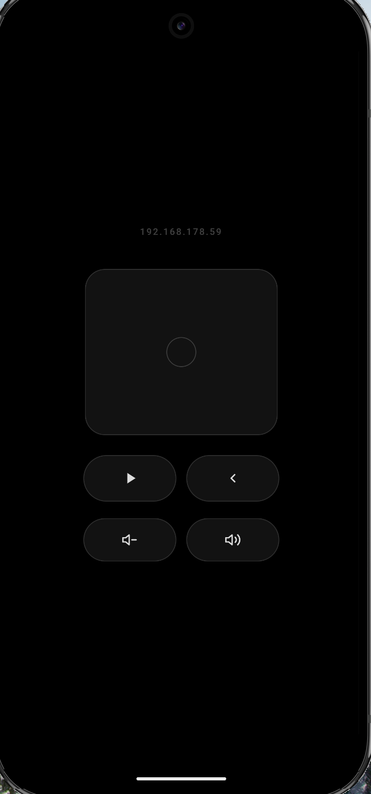

# bare-atv

An Apple TV remote for Android, built with [Bare](https://github.com/holepunchto/bare) and SvelteKit.



## What it does

Turns your Android phone into a proper Apple TV remote. Touchpad, directional taps, play/pause, volume, back — the whole thing.

- Swipe on the touchpad to navigate
- Tap a quadrant (top/bottom/left/right) for directional clicks
- Tap the center circle to select
- Play/pause, back, and volume controls below

## Building

```sh
# macOS
npm run make:darwin

# Android
npm run make:android
```

## Setup

Edit `src/lib/server/atv.ts` and set your Apple TV's IP and companion port:

```ts
host: '192.168.x.x',
port: 49153,
```

On first launch the app will pair — your Apple TV will show a PIN, enter it in the app.
Credentials are saved locally so subsequent launches connect automatically.

## Stack

- [Bare](https://github.com/holepunchto/bare) — lightweight JS runtime for mobile
- [SvelteKit](https://kit.svelte.dev) — UI, served locally by the Bare HTTP server
- [bare-appletv-remote](https://github.com/drache93/bare-appletv-remote) — Apple TV companion protocol
